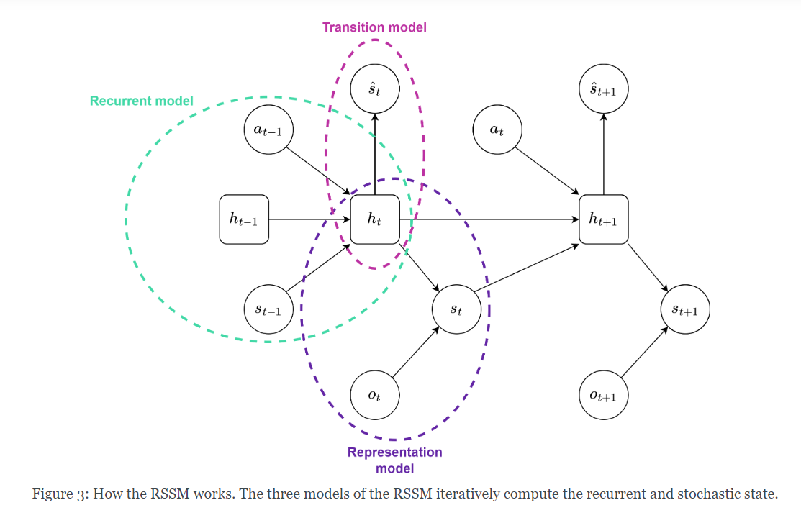
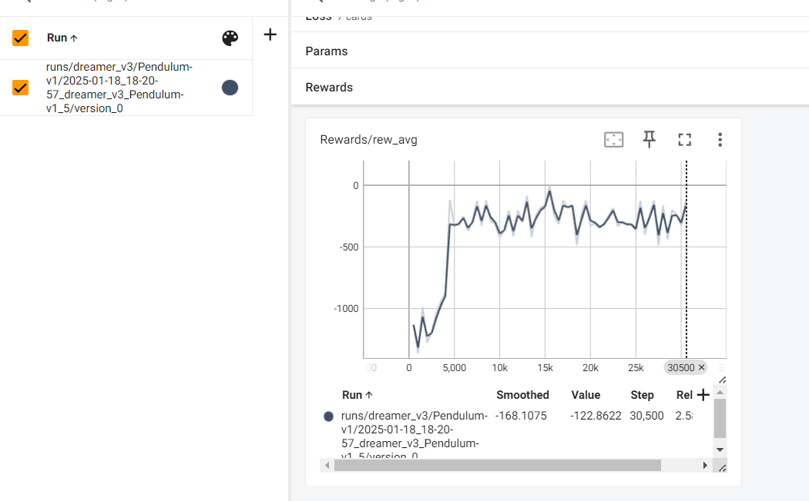
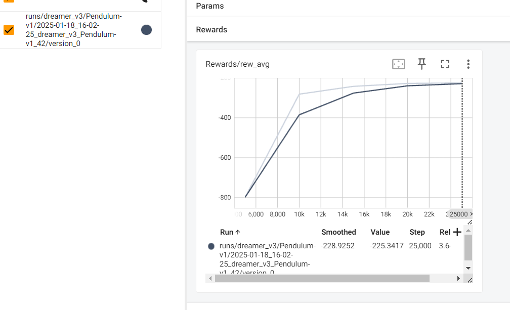

# Intro
This file will contain all the experiements being done to try to solve the environment using Dreamer V3 and some custom changes are required.

### Things completed

14th Jan 2025
* Initial search which algorithm should I try. I am chosing to try using Dreamer V3. Original Code in Jax:

18th Jan 2025
* Reading the algorithms
  * Dreamerv1, Dreamerv2, Dreamerv3. Trying to understand the high-level ideas in order to easily be able to use these models. Also uploaded the pdfs for the papers.
    * https://eclecticsheep.ai/2023/06/16/dreamer_v1.html
      
    * https://eclecticsheep.ai/2023/06/26/p2e.html
    * https://eclecticsheep.ai/2023/07/06/dreamer_v2.html
    * https://eclecticsheep.ai/2023/08/10/dreamer_v3.html
* Trying out [sheeprl](https://github.com/Eclectic-Sheep/sheeprl) Dreamer V3 on
  * easy environments (as suggested in the instructions for report, Pendulum-v0, LunarLander-v2 and HalfCheetah
    * Tried Dreamer V3 XS (and M) on Pendulum-v1 and it seems to be working alright. Below are the rewards collected after 30k steps.
    
    

22nd Jan 2025
  * Try using Dreamer XS on LunarLander-v2 and HalfCheetah.
    * I am facing issues running these environments on sheep-rl. 
  * Checkout what has been trained, how can I do inference on the trained models. I already have the config saved so it shouldn't be too problematic. Although, not necessarily straightforward.
    * I can see that there are checkpoints saved and further there's a evaluation script which I can use. But for now I will try using the original repo in order to run half cheetah.

### Things in progress

  * Trying the original repo.
  * Reading: Looks like there's a way to add [custom environments](https://github.com/Eclectic-Sheep/sheeprl/blob/main/howto/add_environment.md).

### Next Steps
* Read more how-tos: https://github.com/Eclectic-Sheep/sheeprl/tree/main/howto

# Overall Steps

I have around 30 days for this project. I will assume I only have 10 days for exploration, 10 days for deep diving and getting the results better. And the last 10 days are for report and collaborating. There are 5 checkpoints, basic env, hockey training, hockey normal agent, self-play, tournament. we have 30 days -- 6 days to a single thing. I will have my own deadlines now.

### Checkpoint 1 - 24th Jan (Getting code up)
* [x] Choose Dreamer version for running in the exercises.
* [ ] Create plots and analysis for the various work.
  * created automatically by sheeprl
* [x] See how the algorithm works for basic environments.

### Checkpoint 2 - 30th Jan (Hockey Training)

### Checkpoint 3 - 7th Feb (Hockey Normal Agent Play)

### Checkpoint 4 - 14th Feb (Hockey Self Play)

### Checkpoint 5 - 20th Feb (Tournament)
