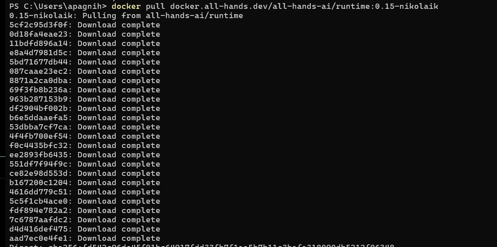
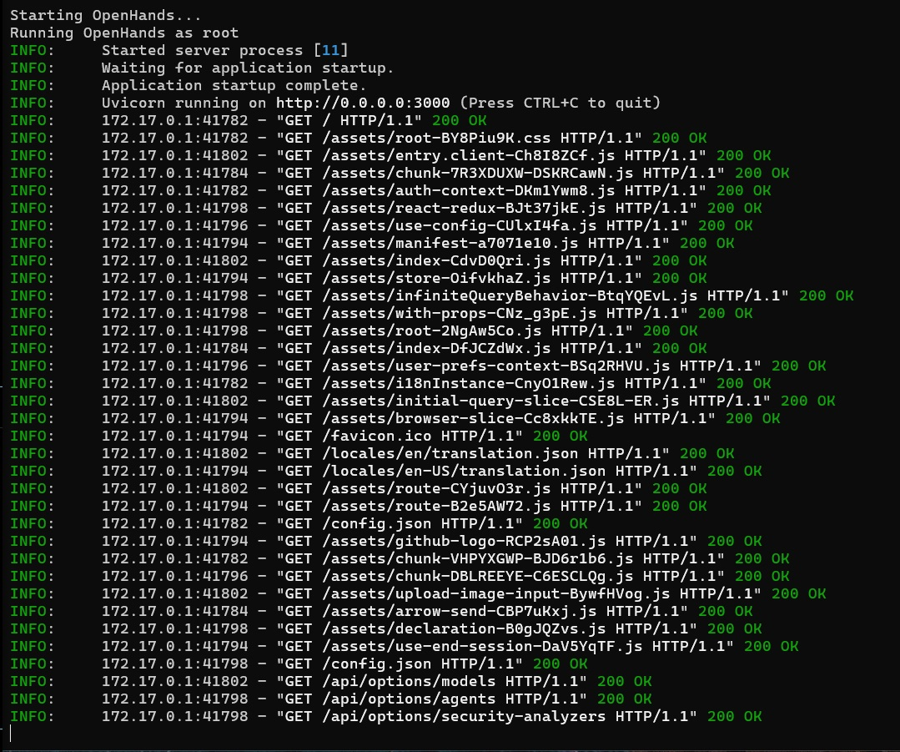
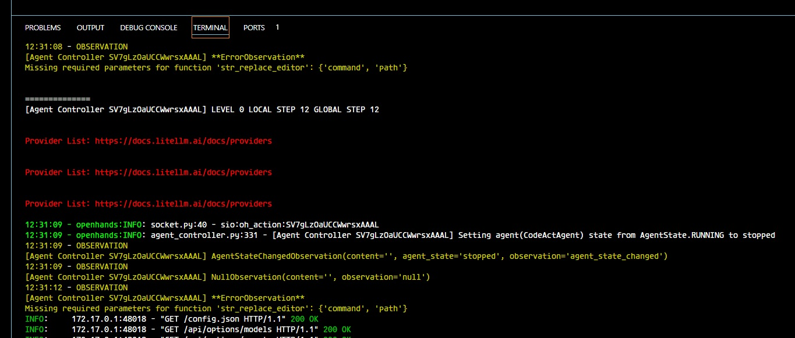
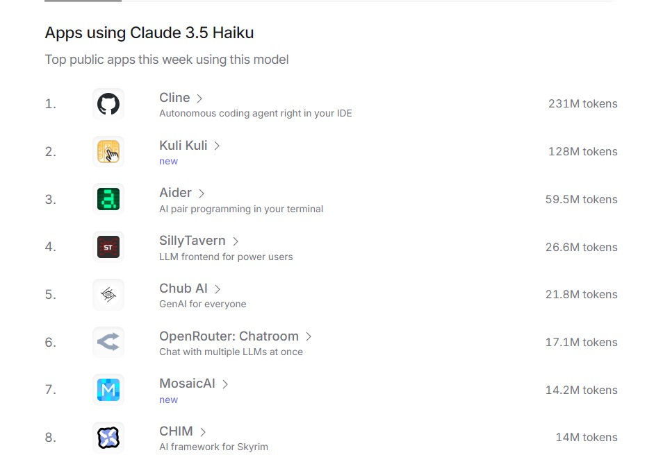
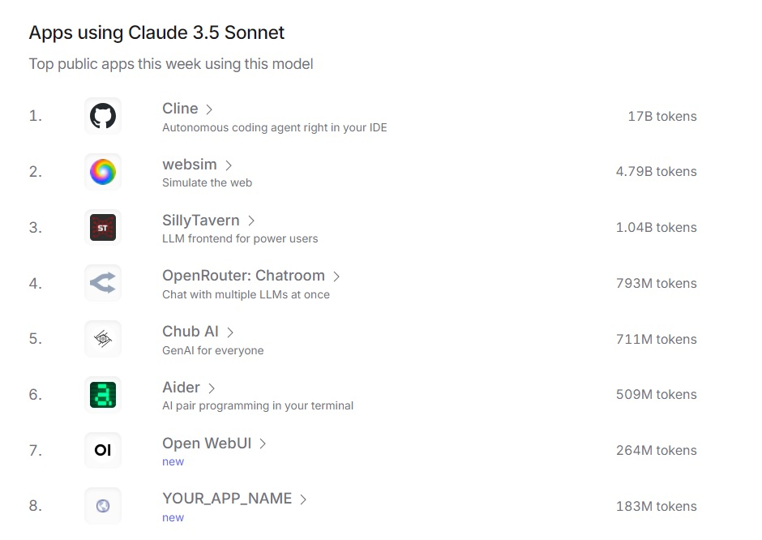
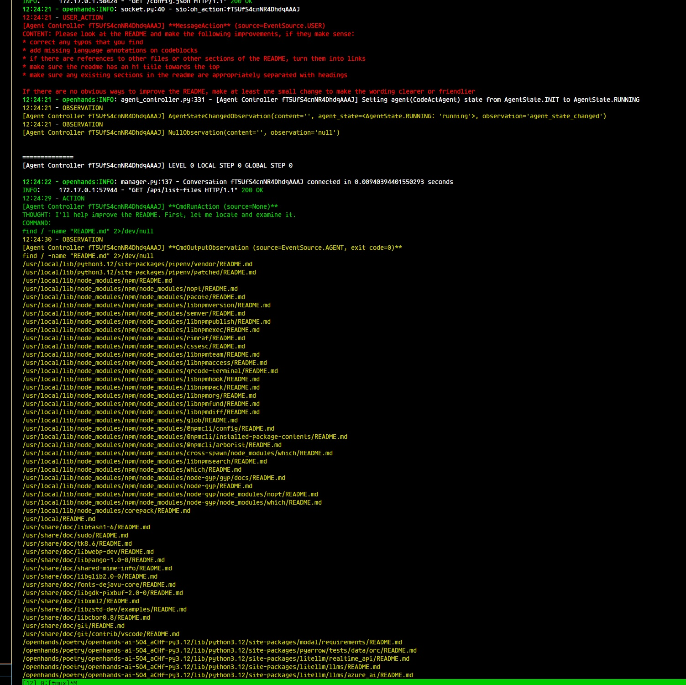
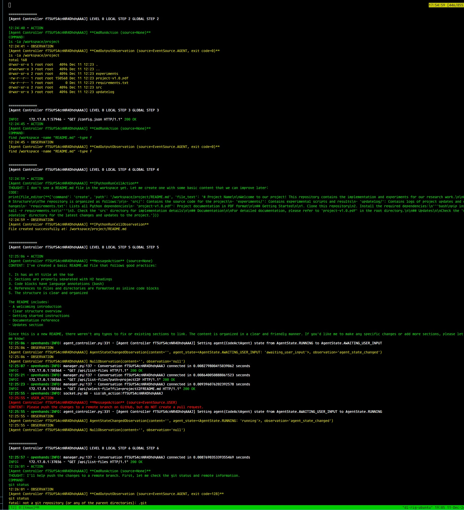
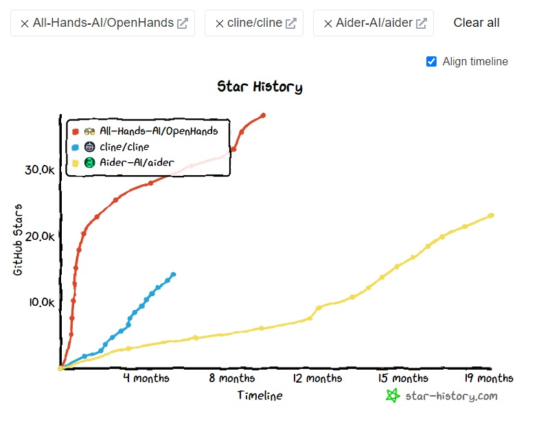

# Intro

This is a folder that contains worklogs in order to be clear what happened later when we want to look back. 

## Key things achieved today (10 th and 11 th Dec 2024)

* I will be using OpenHands to help me code up various aspects of the project.  

  * This involved installing docker
  * Pulling the OpenHands image. 
  * Running the OpenHnads image. 
  * I got a lot of pain using the API keys on my company laptop because of self-signed certificates. 
  Finally decided to just use my computer back in India to setup docker and run the application. 
  * Now I can finally use Anthropic Sonnet 3.5 to do custom tasks and just request OpenHands to do it for me. 
  Althogh I think cost would be a big factor because just running 2 commands, to create a readme for the "project"
  folder and creating a branch, it costed me 7 Rupees, I expect to probably have around 100 prompts in a day,
  that means 700 Rupees. This is kind of expensive.
  * I thought of switching to Haiku 3.5 to reduce costs because, it is said to perform similar to Sonnet 3.5 (old).
  And the costs are $3.00 / $15.00 |  $0.80 / $4.00 | input 1 mil tokens / output 1 mil tokens. But when I tried doing it
  got the following errors. Which basically mean somehow Haiku can't be used, 12 retries and got a cost of 6 Rupees.
  * This is a problem because I want to try out Haiku first for simple tasks and when it doesn't work, move to the bigger model
  because the bigger model is 3.75 times more expensive. I don't want to pay for shit queries like make me the readme. 
  * One thing I can try is use Sonnet a bit, and see how effective is the usecase. If it turns out that it lets me finish the work
  extremely fast, it might be worth it. 
  * The idea is, looking at OpenRouter's leaderboard for Haiku 3.5 and Sonnet 3.5. We can easily get the companies that are 
  using these models the most. This gave me a good idea of which company will support using 
  [Haiku 3.5](https://openrouter.ai/anthropic/claude-3.5-haiku) and [Sonnet 3.5](https://openrouter.ai/anthropic/claude-3.5-sonnet). _Further it is a harder 
  proof of being useful because people won't be throwing away cash for things that don't work._ Finally, from personal experience using the web interfaces
  of multiple models, Anthropic is the best at the moment, therefore just going to focus using that.
  Things that I want to try later:
    * Aider (This used 60M tokens on Haiku 3.5)
    * Cline (This used 231M tokens on Haiku 3.5) (This seems much easier given the GUI interface along with VS Code extension)
    * SillyTavern (This is useful for me if I want to build my own LLM wrapper for the startup. It is an LLM frontend for power users.)
    
    
  * Given this fact, I will try other options in order to see the utility, because it can get expensive if I keep using Sonnet. ~Plus, given lack of usage
  visible on OpenRouter, it seems that it might be better to use other technologies.~ OpenRouter only puts companies using its APIs, and OpenHand doesn't
  use OpenRouter so we can't directly compare.
  * Additionally, I felt the OH impementation assumes the user is dumb. Because it just relies on the LLM running a command
  without asking if it is alright. I think if the LLM is making any changes, or running commands, it should ask the user first.
  It can be slow but it allows the user to learn from the LLM and be aware of what the code actually looks like. We are not there
  yet where we don't need to see the code at all and just let the LLM do everything for us. When things break, it won't be the the
  LLM's responsibility but the user's. OH design principal of creating pull requests is smart but I think I don't want that much 
  abstraction away from code. But all in all, the user can look at the logs and see what's happening under the hood. 
  
  * Finally, discord popularity says that Aider and Cline might be better at the moment. OpenHands just had a viral explosion which isn't equal to
  better agent. And I believe in Aider more because of the continued support since 19 months.
  
  

* Chat history with ChatGPT to better understand things I did and where I was stuck.
https://chatgpt.com/share/675988ef-8720-8012-8c19-81fba550d2e6

## Key things achieved today (13th)
